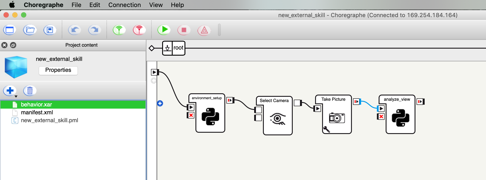

## Detect objects in an image

This repository contains an example behavior that you can use to learn how to 

To "train" a NAO robot to detect objects in its field of vision:
 * Run the "skill" microservice on your local machine
 * Open the example project in Choregraphe, customize and run the behavior

---

### Run the object detection "skill" microservice on your local machine

This example utilizes the https://developer.ibm.com/exchanges/models/all/max-inception-resnet-v2/ microservice. Download and run the Docker container from Docker Hub:

```
$ docker run -it -p 6050:5000 codait/max-inception-resnet-v2 
```
> You can download and build a customized container image by following the instructions in [this README](https://github.com/IBM/MAX-Inception-ResNet-v2/blob/master/README.md#run-locally).

---

### Open the example project in Choregraphe and customize the behavior

#### Clone the example project repository

Clone the repository containing the object detection example project.

```
$ git clone https://github.com/CODAIT/teach-nao-robot-a-new-skill.git
$ cd teach-nao-robot-a-new-skill
$ ls 
  new_external_skill
```

#### Connect your NAO robot to the host machine

* Connect your Nao robot using the provided network cable (or via wifi network) with the host machine.
* Start the robot and note down its IP address (It should be something like `1xx.xxx.xxx.xxx`).
* In a terminal window on  the host machine, run the following command to obtain the host machines' IP address in the network that's shared between the host machine and the robot:
  ```
  $ ifconfig | grep inet | grep 169 | cut -d" " -f2
  ```
  > Replace `169` with the first three digits of your robot's IP address.
* Note the IP address. You will need it to customize the Choregraphe scripts, so your robot can connect to the host machine.

#### Open the example project in Choregraphe, customize and run the behavior

* Open Choregraphe.
* Connect Choregraphe to your robot using 169.xxx.xxx.xxx IP address.
* In Choregraphe open the `choregraphe/new_external_skill/new_external_skill.pml` project.

  

* Edit the `environment_setup` Python box using the script editor.
  * Replace the default value of the `resnet_ip_port` variable with the IP address and port number of the microservice. If you followed the instructions in section ["Run the object detection "skill" microservice on your local machine"](#run-the-object-detection-skill-microservice-on-your-local-machine) to launch the microservice, the port number is `6050`.
    ```
    # ---------------------------------
    # define globals
    # ---------------------------------
    # TODO: customize ip address and port number
    resnet_ip_port = 'your.host.ip.adddress:6050'
    ```
  * Save your changes.
* Run the behavior. The robot will tell you which objects it is seeing.
